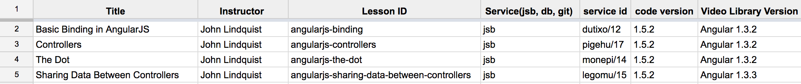

#Reviewing Courses and Lessons
Video training content goes stale. egghead.io should be as up to date as possible when it comes to content. Because of the nature of video we need to monitor each lesson on multiple levels. The general workflow involved in reviewing a lessons is shown below:
* Watch video (1.5x speed preferred)
* Record Basic Information to the review spreadsheet
* Rate based on bite sized, clarity, ‘single-purpose’, code-coverage
* Tag if necessary, record tags
* Update code examples (Process will vary)
  * Github
  * JSBin
  * Plunker
  * local

## Watching the Video
This is as straight forward as it sounds. Hit play. :stuck_out_tongue_winking_eye:

It is important to pay close attention for anything _weird_ in the video. Even though the videos go through a vigorous editing process, sometimes ambient noise can be heard (i.e. static from the mic or kids yelling in the background), this should be noted and the instructor informed (if necessary). 

While watching, you will want to keep in mind the subject that is being taught and how well that is being accomplished. The effectiveness of the video will be rated (explained in the next section). 

As you get more comfortable with reviewing videos, the video player has the function of setting the video speed. After a while __1x__ speed just wont cut it anymore and you'll be _zooming_ through videos at __1.5x__ to __2x__! :fast_forward:

## Recording Basic Information
After the video is reviewed, important information needs to be recorded so that it can be easily found and recalled for later use. This information falls under two categories: _descriptive_ and _rating_.
###Descriptive Information
The basic descriptive information can be found on the lesson page. The information to be recorded is shown bellow: 

The _Title_ and _Instructor_ are straight forward, being the title and author of the video. The _Lesson id_ is the unique _slug_ in the url of the video. That being the _/angularjs-binding_ in _https://egghead.io/lessons/angularjs-binding_ for Basic Binding in AngularJS.

The _service_ is how the code is being presented to the user. This code is shown using a few different services: JSBin(jsb), github, plunker, or local.
###Rating

## Tagging Videos

## Updating Code Examples
The code should work with the latest minor versions of the libraries. Meaning Angular 1.x.x - so 1.5.x would be the current target. For React it would be 15.3.x. Minor version doesn’t matter. Major version releases (Angular 2) have their own category and update path. More info on updating code.